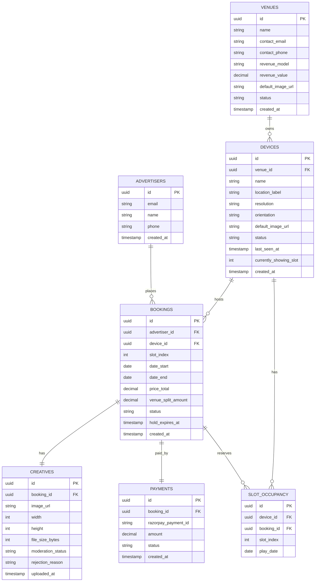
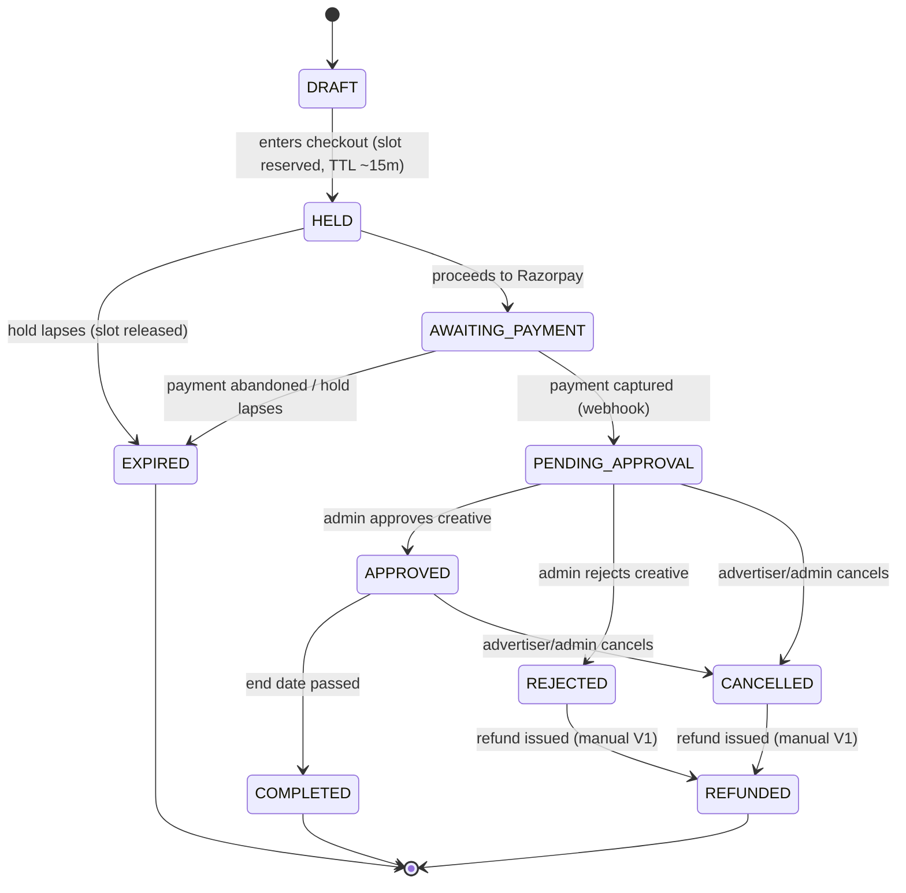

# DOOH Network — V1 Product Requirements Document

**Version:** 1.0 (draft for build)
**Date:** 3 June 2026
**Target launch:** V1 in 1–2 months
**Audience:** Engineering (backend/web + Android), product/ops

---

## 1. Overview

A Digital Out-of-Home (DOOH) advertising marketplace. Venues (cafés, gyms, shops) install our Android TV app on their own existing screens. Each screen runs a fixed 60-second loop of six 10-second slots. Advertisers browse screens on our website, book a slot for a date range, pay, and — once an admin approves the creative — their image plays on that screen for the booked dates. Empty slots play the venue's own default image, so a screen is never blank.

### Objective for V1

Prove the core loop end-to-end with a small number of real venues and advertisers, with humans in the loop for approvals, refunds, and venue onboarding. Optimise for correctness and reliability over features.

### Non-goals for V1

Self-serve venue onboarding, a venue mobile app, earnings/withdrawals, video creatives, full offline mode, per-play proof-of-play logging, position selection, multi-slot bookings, and impression/CPM pricing are all explicitly **out of V1** (see §13).

---

## 2. V1 scope

### In scope

| Area | V1 behaviour |
|---|---|
| Inventory | 60s loop, 6 × 10s slots per device |
| Pricing | Flat price per slot per day |
| Booking | Buy **one slot at a time**; system assigns an available slot; any device, any location |
| Creatives | **Images only** (no video
| Hardware | Venues use **their own TVs**; install our app; one-time login binds the device |
| Player | Polls backend for daily schedule, plays the 6-position loop, caches images locally |
| Empty slots | Fall back to the **per-device default image** |
| Admin | Manually creates venues + devices, approves/rejects creatives, handles refunds by hand |
| Payments | Razorpay checkout; refunds done manually via Razorpay dashboard in V1 |
| Liveness | 60-second heartbeat per device (alive + currently showing) |
| Double-booking | Prevented at the DB level — this is correctness, not polish |
| Notifications | Email/WhatsApp to admin on new booking |

### Explicitly out of scope (deferred — see §13)

Multi-slot bookings · video + transcoding · full offline resilience · per-play proof-of-play · automated refunds and authorize/capture · GST automation · position selection · CPM · venue mobile app · venue earnings UI · withdrawals/payouts.

### The two things V1 cannot cut

1. **Double-booking prevention** (§6, §7) — two ads must never collide on one slot/date.
2. **Heartbeat** (§9, §10) — without a liveness signal we will sell slots on dark screens.

---

## 3. Core concepts

### 3.1 What is sold

One booking = **(device) × (one loop slot) × (date range)**. The ad plays roughly once per loop, for all of the venue's operating hours, on every day in the range.

### 3.2 The loop is six fixed positions

The player always walks positions 1 → 6, 10 seconds each, forever. Each position on a given day is either:

- **Booked** → show the booked advertiser's image, or
- **Empty** → show the device's default image.

There are no variable-length loops and no special-casing of empties. When a booking ends, its position silently reverts to the default — no gap, no redeploy.

### 3.3 The default image

- Every device **must** have a fallback image; a device can never exist without one. Set it at device creation.
- The default is **per-device** (lives on the device record), not global. It defaults to the venue's image but can be overridden per device.
- A device with zero bookings plays the venue's default in all 6 positions — the screen shows value from day one.
- The default is editable later by an admin (manual in V1).

---

## 4. System components & recommended stack

| Component | Responsibility | Recommended tech |
|---|---|---|
| Marketplace website | Browse devices, see availability, book, pay, upload image | Next.js |
| Admin panel | Create venues/devices, approve creatives, refunds, screen health | Next.js (role-gated) or a fast internal tool |
| Backend API + DB | Inventory, bookings, scheduling, device auth, heartbeat | Node.js (NestJS/Express) or Python (FastAPI/Django) + PostgreSQL |
| Android TV player | Login, pull schedule, cache images, play loop, heartbeat | **Native Kotlin + ExoPlayer** |
| Media storage/CDN | Store and deliver images | Bunny Storage + Bunny CDN |
| Payments | Checkout, refunds | Razorpay (INR, UPI, GST invoices) |
| Notifications | Alert admin on new booking | Transactional email + WhatsApp/Telegram |

> Build the player **native Kotlin**, not React Native/Flutter. Boot-launch, kiosk mode, local caching, and reliability are far more robust native, and it's the long pole — start it in week 1.

---

## 5. Data model

The single most important structural decision: **a venue is a first-class entity** (it owns devices, holds revenue terms, and will later have a login + balance), and **every booking freezes the venue's revenue split at the time of booking**. Modelling this now — even with no venue-facing UI — makes the future venue app additive instead of a rewrite.

### 5.1 Entity-relationship diagram



### 5.2 Key field notes

- **`venues.revenue_model`** — `percentage` or `flat`. **`revenue_value`** is the percentage (e.g. `0.30`) or the flat monthly rent. A *percentage* model is what makes the future venue earnings app compelling; a flat model makes "earnings" a fixed number. Decide per venue (see §15).
- **`bookings.venue_split_amount`** — the venue's cut **frozen at booking time**. Never compute earnings live from current terms; terms change. Future "venue earnings" = `SUM(venue_split_amount)` over the venue's completed bookings. This one field is what makes the venue app trivial later.
- **`bookings.slot_index`** — 1–6, assigned by the system at checkout (advertiser buys "a slot," not a specific position).
- **`bookings.hold_expires_at`** — when a `HELD` reservation lapses (§7).
- **`devices.default_image_url`** — per-device fallback; seeded from the venue default at creation, overridable.
- **`devices.last_seen_at` / `currently_showing_slot`** — written by the heartbeat (§10); drive screen-health and "don't sell dark screens."

### 5.3 Double-booking prevention (must-have)

`SLOT_OCCUPANCY` is the bulletproof guard: one row per **(device, slot, play_date)** with a **unique constraint on `(device_id, slot_index, play_date)`**. When a booking is confirmed, expand its date range into one occupancy row per day. The unique constraint makes a double-book physically impossible even under a race.

> Simpler alternative if you prefer no fan-out table: enforce availability with an overlap query inside a `SERIALIZABLE` transaction with row locking on the device. Acceptable for V1 volume, but the occupancy table is recommended — it's also exactly the structure availability lookups want to read.

---

## 6. Booking lifecycle



Notes:

- **Whether a booking is "live" right now is derived** from `APPROVED` + today ∈ `[date_start, date_end]`. No separate `PLAYING` status needed; the schedule endpoint computes it.
- **Every transition is a logged event** (who/when/why). Get this state machine right and most edge cases resolve themselves.
- **Slot occupancy is written when the booking reaches `PENDING_APPROVAL`** (i.e. paid), and released on `EXPIRED`/`CANCELLED`/`REJECTED`. A `HELD` booking holds the slot via the live availability check + `hold_expires_at`, not yet via occupancy rows.

---

## 7. Pricing, payments & refunds (V1)

- **Price** = `slot_day_price × number_of_days`. `slot_day_price` is configured per device.
- **Hold** — on entering checkout, reserve the chosen slot/dates for ~15 minutes; release on timeout.
- **Charge timing** — charge in full at checkout. (Authorize/capture is deferred.)
- **Webhook idempotency** — Razorpay may deliver a webhook more than once. Use `razorpay_payment_id` as an idempotency key; never create two bookings or two payment rows for one payment.
- **Refunds** — **manual via the Razorpay dashboard** in V1, triggered when admin rejects a creative or a booking is cancelled. The booking moves `REJECTED/CANCELLED → REFUNDED` once done.
- **GST/invoicing** — Razorpay can issue GST-compliant invoices; confirm GST registration details before go-live (§15).

---

## 8. Creative requirements (images only, V1)

Validate **at upload, before payment**, with clear guidance on failure:

- **Format:** JPG or PNG (sRGB).
- **Recommended spec:** 1920 × 1080, 16:9 landscape (confirm against the actual screens — see §15). Reject mismatched aspect ratios.
- **Max file size:** 5 MB (tune as needed).
- **Display duration:** fixed at 10s (the slot length) — no per-creative duration since it's a still image.
- **Moderation = admin approval.** Approving a creative is "is this ad legal/acceptable?" Maintain a written content policy (no illegal, adult, hateful, or misleading ads) so rejections aren't arbitrary. Store `rejection_reason` for the advertiser.

---

## 9. Android TV player (the long pole)

The player is the highest-risk component. V1 requirements:

1. **One-time login binds the device.** Admin creates the device record and generates a credential (code or username/password). On first launch the app prompts for it; on success it stores a long-lived **device token**. The TV is now bound to that device record. *(This is the "pairing" — renamed. The "choose a specific device" feature on the website depends entirely on this binding existing.)*
2. **Schedule pull.** On launch and then periodically (e.g. every few minutes), fetch today's schedule — the 6 positions, each either a booked image URL or the device default.
3. **Local image caching.** Download today's images to local storage once and **play from disk**, not by re-streaming every loop. For images this is trivial (a few hundred KB each) and gives basic resilience against wifi blips — a momentary drop doesn't blank the screen. *(This is not full offline mode, which is v2; it's just "don't re-fetch every 10 seconds.")*
4. **Playback loop.** Walk positions 1 → 6, 10s each, indefinitely. Booked position → booked image; empty position → device default.
5. **Heartbeat.** Every 60 seconds, POST liveness (§10): alive, current slot, current image, app version, timestamp. Use **server time** for scheduling decisions, not device time.
6. **Boot launch + recovery.** Auto-start on power-on (`BOOT_COMPLETED`), kiosk/lock-task mode, and a watchdog that restarts playback if it freezes. TVs get power-cycled constantly.

> Full offline resilience, per-play proof-of-play, and remote control (reboot/screenshot) are **v2**. The 60s heartbeat is the V1 minimum and is ~30 minutes of work on top of schedule polling — keep it.

---

## 10. Device API contract

All device endpoints (except login) require the device token in an `Authorization` header.

### `POST /api/device/login`

Bind a physical TV to its device record.

```json
// request
{ "credential": "CAFE-CONNAUGHT-7Q2X" }
// response
{
  "device_token": "<long-lived token>",
  "device_id": "uuid",
  "config": { "loop_seconds": 60, "slot_count": 6, "heartbeat_seconds": 60 }
}
```

### `GET /api/device/schedule?date=YYYY-MM-DD`

Return the full 6-position loop for the day. The player needs no logic beyond "download images, then play positions in order."

```json
{
  "date": "2026-06-15",
  "default_image_url": "https://cdn.../venue-default.jpg",
  "positions": [
    { "slot_index": 1, "type": "booked",  "image_url": "https://cdn.../ad-aaa.jpg", "booking_id": "uuid" },
    { "slot_index": 2, "type": "default", "image_url": "https://cdn.../venue-default.jpg" },
    { "slot_index": 3, "type": "booked",  "image_url": "https://cdn.../ad-bbb.jpg", "booking_id": "uuid" },
    { "slot_index": 4, "type": "default", "image_url": "https://cdn.../venue-default.jpg" },
    { "slot_index": 5, "type": "default", "image_url": "https://cdn.../venue-default.jpg" },
    { "slot_index": 6, "type": "default", "image_url": "https://cdn.../venue-default.jpg" }
  ]
}
```

### `POST /api/device/heartbeat`

```json
// request (every 60s)
{
  "device_id": "uuid",
  "currently_showing_slot": 3,
  "currently_showing_image": "ad-bbb.jpg",
  "app_version": "1.0.0",
  "timestamp": "2026-06-15T10:32:00Z"
}
// response
{ "ok": true }
```

The backend updates `devices.last_seen_at` and `currently_showing_slot`. A device not seen for N minutes is flagged unhealthy and **its inventory should not be sold** until it recovers.

---

## 11. Admin panel functions (V1)

- Create/edit **venues**: contact info, **revenue model + value**, default image.
- Create/edit **devices** under a venue: name, location label, resolution/orientation, per-device default image (seeded from venue default), `slot_day_price`, generate login credential.
- **Booking queue** with new-booking notifications; review the uploaded creative; **approve** or **reject** (with reason).
- Trigger a **manual refund** (do it in Razorpay, mark booking `REFUNDED`).
- **Screen health** view: per device — online/offline (from heartbeat), currently showing, last seen.

---

## 12. Marketplace website functions (V1)

- Browse devices by location; view per-device details (venue, location, price/day).
- See **availability** for chosen dates (from `SLOT_OCCUPANCY`).
- Book **one slot** for a date range; system assigns an available slot.
- Checkout via Razorpay; **upload image** (validated per §8) as part of the flow.
- Booking status visible to the advertiser (pending approval / approved / rejected + reason / refunded).

---

## 13. Designed for v2 (do not block these)

These are **not built in V1**, but the V1 foundation is shaped so they're additive:

| Future feature | What V1 already supports | Don't do this in V1 |
|---|---|---|
| Venue mobile app | Venue is a first-class entity with its own record | Treating venue as a string label on a device |
| Venue earnings | `bookings.venue_split_amount` frozen per booking | Computing earnings live from current terms |
| Withdrawals / payouts | Venue entity + per-booking splits | Building a "withdraw" button casually — payouts are regulated (RazorpayX, KYC, TDS); talk to an accountant first |
| Multi-slot bookings | One booking = one slot; data model allows many bookings per device | Hard-coding "one slot" anywhere beyond the checkout UI |
| Proof-of-play | Heartbeat already reports current slot/image | — |
| Full offline mode | Local image caching already in V1 | — |
| Video creatives | Creative is a separate entity per booking | Assuming "image" everywhere in the schema/validation beyond the validator |
| Position selection / CPM | Slot index stored per booking | Building pricing logic that can't extend |

---

## 14. V1 acceptance criteria (definition of done)

- [ ] An advertiser can browse a device, pick dates, see a slot is available, pay, and upload an image.
- [ ] Two advertisers **cannot** book the same device/slot/date (verified under concurrent attempts).
- [ ] A held slot is released automatically when the hold expires.
- [ ] Admin receives a notification, reviews the creative, and can approve or reject with a reason.
- [ ] On approval, the image plays in its assigned slot on the booked dates; on rejection, admin refunds and the slot frees up.
- [ ] A freshly installed TV logs in once and is bound to its device record.
- [ ] The player plays the 6-position loop, filling empty positions with the per-device default, and survives a brief wifi drop without blanking (images served from local cache).
- [ ] The admin screen-health view reflects each device's online/offline state and current slot within ~1–2 minutes (heartbeat).
- [ ] A Razorpay webhook delivered twice does not create duplicate bookings/payments.

---

## 15. Open decisions to confirm before/early in build

1. **Revenue split model** — percentage vs flat (per venue). Shapes whether "earnings" varies with bookings and how compelling the future venue app is.
2. **Screen resolution/orientation** — confirm the standard so the creative spec (§8) is correct. Pick one standard box/TV setup rather than supporting "any TV."
3. **GST registration & invoicing** details for Razorpay.
4. **Approval SLA** — how long admin has to approve before a start date passes, and the auto-handling if missed (even a manual rule for V1).
5. **Content policy** wording — the written acceptance criteria for creatives.
6. **App update channel** — Play Store vs sideload + self-update.

---

## 16. Suggested timeline (~8 weeks)

Assumes ~1 backend/web dev, 1 Android dev, plus product/ops. If one person does everything including the native player, double it.

- **Week 0** — Lock open decisions (§15). Sign 2–3 venue agreements. Buy and standardise on one Android TV box. Write content + refund policies.
- **Weeks 1–2** — Backend: data model, booking state machine, Razorpay + idempotent webhook, Bunny setup, device auth.
- **Weeks 2–4** — Android player (start early): login, schedule pull, image cache, loop, heartbeat, boot-launch + kiosk. Test on the real box with the network unplugged.
- **Weeks 3–5** — Website + admin: marketplace + availability, checkout + image upload/validation, admin queue + approve/reject + screen health, notifications.
- **Week 6** — End-to-end integration; deliberately test the unhappy paths (double-book, rejected creative + refund, webhook replay, expired hold, dark screen).
- **Week 7** — Pilot on the real venue screens; run your own ads first; verify the loop runs for days.
- **Week 8** — Soft launch with a handful of friendly advertisers; humans in the loop; find failure modes at small scale.

---

*End of V1 PRD.*
