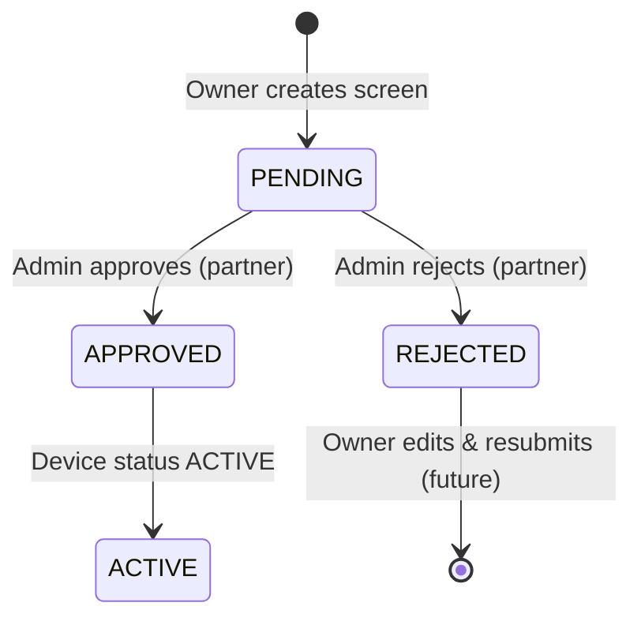

# DOOH Network — Screen Owner & Advertiser PRD

**Version:** 1.0  
**Date:** 15 June 2026  
**Audience:** Engineering (owner portal, advertiser portal, marketplace checkout)  
**Out of scope:** Admin panel, admin APIs, booking moderation, refunds, screen-health admin UI (partner-owned)

**Parent doc:** [`DOOH_Network_V1_PRD.md`](DOOH_Network_V1_PRD.md)  
**Related ADRs:** [008](../docs/adr/008-screen-owner-self-serve.md), [002](../docs/adr/002-creative-spec.md), [005](../docs/adr/005-content-policy.md)

---

## 1. Overview

### What you own

| Area | Routes / surfaces | Backend modules |
|------|-------------------|-----------------|
| **Screen Owner** | `/owner/*`, `/api/owner/*` | `apps/api/src/owner/` |
| **Advertiser** | `/advertiser/*` | `apps/api/src/advertiser/` |
| **Marketplace** | `/`, `/devices/[id]`, `/bookings/[id]` | `marketplace`, `booking`, `creatives`, `payments` (consume only) |
| **Auth (shared)** | `/login`, `/signup`, `/api/auth/*` | `apps/api/src/auth/` |

### What your partner owns (dependency only)

- Admin creates/edits venues & devices (legacy path)
- **Screen approval queue** — owner-submitted screens start `PENDING` / `INACTIVE` until admin approves
- Creative approve/reject, manual refunds
- Admin notifications on new bookings
- `/admin/health` screen-health console

You **depend** on admin approval before owner screens appear on the marketplace. You do **not** build those admin flows.

### Objective for your scope

1. Screen owners can self-serve: sign up → add screens → get pairing credential → see online/offline status.
2. Advertisers can browse, book, pay, upload creative, and track bookings in a dashboard.
3. Checkout identity is reliable: logged-in advertisers see all their bookings; guest flow still works.

### Non-goals (your scope)

- Venue earnings, withdrawals, payout UI
- Admin moderation UI
- Video creatives, multi-slot booking, position picker
- Password reset (P2 — nice to have)
- Credential rotation (partner or later)

---

## 2. Personas

### Screen Owner (`SCREEN_OWNER`)

Café/gym/shop operator. Installs Android TV player on existing screen. Wants to list inventory and earn from ad slots without ops hand-holding.

### Advertiser (`ADVERTISER`)

Local business buying one slot on one screen for a date range. May book as guest or with an account.

### Guest advertiser (no account)

Can complete marketplace checkout with email/name/phone. Should be able to link to an account later.

---

## 3. Screen Owner — Requirements

### 3.1 Signup & auth

| ID | Requirement | Priority |
|----|-------------|----------|
| OW-A1 | Signup with role `SCREEN_OWNER` on unified `/signup` | P0 |
| OW-A2 | On signup, atomically create `User` + `Venue` with `ownerId`, revenue default 30% (ADR 001) | P0 |
| OW-A3 | Login → `owner_token` cookie → access `/owner/*` | P0 |
| OW-A4 | Middleware blocks unauthenticated access to `/owner/*` | P0 |
| OW-A5 | Password reset | P2 |

**Current status:** OW-A1–A4 ✅ · OW-A5 ❌

**Key files:** `auth.service.ts`, `SignupForm.tsx`, `middleware.ts`, `auth-cookies.ts`

### 3.2 Owner dashboard (`/owner`)

| ID | Requirement | Priority |
|----|-------------|----------|
| OW-D1 | Stats: total screens, online count, avg price/day | P0 |
| OW-D2 | Recent screens list with approval + online badges | P0 |
| OW-D3 | CTA to add new screen | P0 |
| OW-D4 | Empty state when no screens | P1 |

**Current status:** OW-D1–D3 ✅

**Key file:** `apps/web/src/app/owner/page.tsx`

### 3.3 Screen management (`/owner/screens`)

| ID | Requirement | Priority |
|----|-------------|----------|
| OW-S1 | List all owner's screens | P0 |
| OW-S2 | Create screen: name, location, resolution, orientation, price/day | P0 |
| OW-S3 | Minimum **3 images** on create (gallery → `DeviceImage`) | P0 |
| OW-S4 | Upload images to Bunny (presign + proxy routes) | P0 |
| OW-S5 | Show **player pairing credential** once after create | P0 |
| OW-S6 | Edit screen (same fields, ≥3 images on update if images changed) | P0 |
| OW-S7 | Soft-delete / deactivate (`status: INACTIVE`) | P1 |
| OW-S8 | Show `approvalStatus`: PENDING / APPROVED / REJECTED + rejection reason | P0 |
| OW-S9 | Show online/offline from `lastSeenAt` (60s heartbeat, 10min liveness window) | P0 |
| OW-S10 | Edit venue profile (name, contact, default image) | P2 |
| OW-S11 | Multiple venues per owner | P2 |
| OW-S12 | Dedicated screen health page (per-screen heartbeat history) | P2 |
| OW-S13 | Credential regeneration | P2 |

**Current status:** OW-S1–S9 ✅ · OW-S10–S13 ❌

**Key files:**

- Pages: `app/owner/screens/*`
- Components: `ScreenForm.tsx`, `ImageUploader.tsx`, `OwnerScreensTable.tsx`
- API: `owner.controller.ts`, `owner.service.ts`
- Schema: `packages/shared/src/owner-device.ts`

### 3.4 Owner screen lifecycle (with admin dependency)



| ID | Requirement | Owner builds | Partner builds |
|----|-------------|--------------|----------------|
| OW-L1 | New owner screen = `approvalStatus: PENDING`, `status: INACTIVE` | ✅ | — |
| OW-L2 | Only `APPROVED` + `ACTIVE` screens on marketplace | — | ✅ (marketplace filter) |
| OW-L3 | Owner sees pending/rejected state clearly | ✅ | — |
| OW-L4 | Owner can edit & resubmit rejected screen | P1 | — |
| OW-L5 | Immediate marketplace listing (ADR 008 original) | ❌ superseded | Approval gate |

**Note:** ADR 008 said immediate listing; repo uses admin approval. Align with partner on whether rejected screens can be re-edited to re-enter queue.

### 3.5 Owner API contract (your backend)

All require `Authorization: Bearer <owner_token>`.

| Method | Path | Purpose |
|--------|------|---------|
| GET | `/api/owner/screens` | List owner's devices |
| POST | `/api/owner/screens` | Create device + credential |
| GET | `/api/owner/screens/:id` | Get one |
| PATCH | `/api/owner/screens/:id` | Update |
| DELETE | `/api/owner/screens/:id` | Deactivate |
| POST | `/api/owner/upload/presign` | Bunny presign |
| POST | `/api/owner/upload` | Dev upload fallback |
| DELETE | `/api/owner/upload` | Remove staged image |

---

## 4. Advertiser & Marketplace — Requirements

### 4.1 Signup & auth

| ID | Requirement | Priority |
|----|-------------|----------|
| AD-A1 | Signup with role `ADVERTISER` | P0 |
| AD-A2 | Create `Advertiser` profile linked to `User.userId` | P0 |
| AD-A3 | On signup, link existing `Advertiser` row by email (guest bookings) | P0 |
| AD-A4 | Login → `advertiser_token` → `/advertiser/*` | P0 |
| AD-A5 | Password reset | P2 |

**Current status:** AD-A1–A4 ✅ · AD-A5 ❌

### 4.2 Marketplace browse (public — PRD §12)

| ID | Requirement | Priority |
|----|-------------|----------|
| MK-1 | Browse devices; filter by city (`locationLabel`) | P0 |
| MK-2 | Device card: venue, location, price/day, online badge | P0 |
| MK-3 | Device detail page | P0 |
| MK-4 | Availability checker for date range | P0 |
| MK-5 | Hide offline/stale devices in production | P0 |
| MK-6 | Only admin-approved owner screens listed | P0 |

**Current status:** MK-1–MK-6 ✅ (marketplace service filters `approvalStatus: APPROVED`)

**Key files:** `(marketplace)/page.tsx`, `devices/[id]/page.tsx`, `AvailabilityChecker.tsx`

### 4.3 Checkout & booking

| ID | Requirement | Priority |
|----|-------------|----------|
| BK-1 | Book **one slot**; system assigns slot 1–6 | P0 |
| BK-2 | Price = `slot_day_price × days` | P0 |
| BK-3 | Validate creative **before payment** (JPG/PNG, 16:9, 5MB — ADR 002) | P0 |
| BK-4 | Upload creative → hold → Razorpay → attach creative | P0 |
| BK-5 | Dev simulate-capture when no Razorpay keys | P0 |
| BK-6 | **Guest checkout** with email/name/phone | P0 |
| BK-7 | **Authenticated checkout** — use logged-in advertiser, no duplicate form | **P0** |
| BK-8 | Prefill name/email/phone when advertiser logged in | P1 |
| BK-9 | Link content policy (ADR 005) in upload UI | P1 |
| BK-10 | Booking status page `/bookings/[id]` | P0 |
| BK-11 | Status page scoped to owner of booking (not public UUID) | P1 |
| BK-12 | Re-upload creative after rejection | P2 |

**Current status:** BK-1–BK-11 ✅ · BK-12 ❌

**Key files:** `BookingForm.tsx`, `booking.controller.ts`, `bookings/[id]/page.tsx`, `advertiser/bookings/[id]/page.tsx`

### 4.4 Advertiser dashboard (`/advertiser`)

| ID | Requirement | Priority |
|----|-------------|----------|
| AD-D1 | Stats: total bookings, active campaigns, total spend | P0 |
| AD-D2 | Table: screen, dates, status, creative moderation, price | P0 |
| AD-D3 | Link to booking detail `/bookings/:id` | P0 |
| AD-D4 | CTA "Book a screen" → marketplace | P0 |
| AD-D5 | Show rejection reason when creative rejected | P1 |
| AD-D6 | Show assigned slot index | P2 |
| AD-D7 | Email notification on approve/reject | P2 (partner may own) |

**Current status:** AD-D1–D6 ✅ · AD-D7 ❌ (partner notifications)

**Key files:** `app/advertiser/page.tsx`, `advertiser.controller.ts`, `advertiser/bookings/[id]/page.tsx`

### 4.5 Advertiser API contract

| Method | Path | Auth | Purpose |
|--------|------|------|---------|
| GET | `/api/advertiser/me` | advertiser JWT | Profile for checkout prefill |
| GET | `/api/advertiser/bookings` | advertiser JWT | List my bookings |
| GET | `/api/advertiser/bookings/:id` | advertiser JWT | Single booking + rejection reason |

**Hold checkout:** `POST /api/bookings/hold` accepts optional advertiser JWT via `advertiser_token` cookie.

---

## 5. Shared auth UX

| ID | Requirement | Status |
|----|-------------|--------|
| AU-1 | Single `/signup` with role: Screen Owner \| Advertiser | ✅ |
| AU-2 | Single `/login`; redirect to role dashboard | ✅ |
| AU-3 | Role-exclusive cookies (one role per browser session) | ✅ |
| AU-4 | Logged-in user redirected from `/login` to dashboard | ✅ |
| AU-5 | Marketplace nav link to login/signup | Verify in layout |
| AU-6 | No admin option on public signup | ✅ |

**Key files:** `(auth)/login`, `(auth)/signup`, `auth-session.ts`, `dashboard-nav.ts`

---

## 6. Data model (your tables)

| Model | Your use |
|-------|----------|
| `User` | `SCREEN_OWNER` / `ADVERTISER` roles |
| `Venue` | `ownerId` → owner user; created on owner signup |
| `Device` | Owner CRUD; `approvalStatus`, liveness fields |
| `DeviceImage` | Owner gallery (≥3) |
| `Advertiser` | `userId` optional; guest bookings by email |
| `Booking` | Marketplace creates; dashboard reads |
| `Creative` | Upload flow; moderation status display |

Schema: `packages/db/prisma/schema.prisma`

---

## 7. Implementation scorecard (your scope only)

### Screen Owner

| Area | Done | Partial | Missing |
|------|------|---------|---------|
| Auth & signup | 4 | 0 | 1 (password reset) |
| Dashboard | 3 | 0 | 0 |
| Screen CRUD | 9 | 0 | 4 (venue edit, multi-venue, health page, credential rotation) |
| **Total** | **~85%** | | |

### Advertiser + Marketplace

| Area | Done | Partial | Missing |
|------|------|---------|---------|
| Auth & signup | 4 | 0 | 1 |
| Marketplace browse | 6 | 0 | 0 |
| Checkout | 11 | 0 | 1 (re-upload after rejection) |
| Dashboard | 6 | 0 | 1 (notifications) |
| **Total** | **~90%** | | |

---

## 8. Acceptance criteria (your definition of done)

- [x] Screen owner signs up, adds screen with 3+ images, receives pairing credential.
- [x] Owner sees PENDING until partner approves; screen appears on marketplace after approval.
- [x] Owner sees online/offline per screen from heartbeat.
- [x] Advertiser signs up, browses marketplace, checks availability, books with login (no guest form).
- [x] Guest can still checkout without account; signing up with same email shows prior bookings.
- [x] Advertiser dashboard lists all their bookings with correct status.
- [x] Creative spec validated before payment; content policy linked at upload.
- [x] Booking status page works for advertiser (auth-scoped at `/advertiser/bookings/[id]`).

---

## 9. Your prioritized backlog

### Sprint 1 — Advertiser identity ✅

1. ~~**BK-7** Wire `BookingForm` to session~~
2. ~~**BK-8** Prefill contact from user profile~~
3. ~~**BK-9** Link ADR 005 content policy in `BookingForm`~~

### Sprint 2 — Advertiser dashboard polish ✅

4. ~~**AD-D5** Show `creative.rejectionReason`~~
5. ~~**BK-11** Auth-scoped `/advertiser/bookings/[id]`~~
6. ~~**AD-D6** Show `slotIndex` in booking table~~

### Sprint 3 — Owner polish

8. **OW-L4** Rejected screen: allow edit → reset to `PENDING` (coordinate with partner API)
9. **OW-S10** Venue profile edit page (name, contact, default image)
10. Empty states + error handling pass on owner flows

### Sprint 4 — Nice to have

11. **AU-5 / OW-A5** Password reset
12. **BK-12** Re-upload creative after rejection
13. Seed demo advertiser account in `seed.ts` for local dev

---

## 10. Dependencies on admin partner

| You need from partner | Why |
|----------------------|-----|
| Screen approval (`PENDING` → `APPROVED`) | Owner screens won't list until approved |
| Creative moderation | Advertiser sees `PENDING_APPROVAL` → `APPROVED`/`REJECTED` |
| Refunds on reject | Advertiser status → `REFUNDED` (you display only) |
| Env: Razorpay, Bunny, webhooks | Checkout won't work in prod without their infra setup |

**Contract to agree:** When owner edits a rejected screen, does it auto-return to `PENDING`? Who triggers that — your PATCH or their admin action?

---

## 11. Key file map (your scope)

```
apps/web/src/app/owner/              Owner pages
apps/web/src/app/advertiser/         Advertiser pages
apps/web/src/app/(marketplace)/      Public marketplace
apps/web/src/app/(auth)/             Login/signup
apps/web/src/app/api/owner/          Owner BFF proxies
apps/web/src/components/owner/       Owner UI
apps/web/src/components/advertiser/  Advertiser UI
apps/web/src/components/BookingForm.tsx   Checkout (main gap)
apps/api/src/owner/                  Owner API
apps/api/src/advertiser/             Advertiser API
apps/api/src/auth/                   Shared auth
packages/shared/src/owner-device.ts  Screen validation
packages/shared/src/auth.ts          Role schemas
```

---

## 12. Deviations to track

| Doc | Says | Repo does |
|-----|------|-----------|
| PRD §13 | No self-serve venue onboarding | Owner portal built (ADR 008) |
| ADR 008 | Immediate marketplace listing | Admin approval gate (partner) |
| PRD §12 | Advertiser books on website | Guest-only checkout; dashboard disconnected |

---

*Track implementation in [`docs/OWNER_ADVERTISER_TASKS.md`](../docs/OWNER_ADVERTISER_TASKS.md).*
