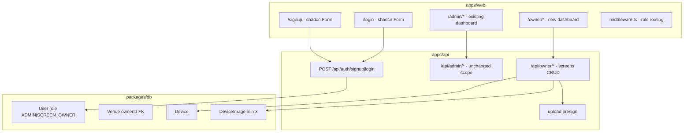
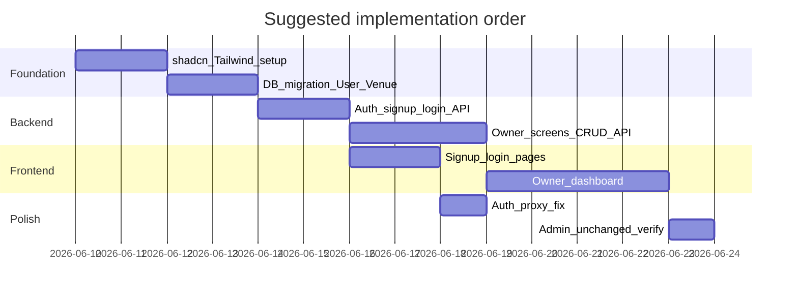

# Implementation Guide: shadcn/ui, Signup, and Screen Owner Dashboard

**Status:** Draft implementation plan  
**Last updated:** 2026-06-10  
**Scope:** `apps/web`, `apps/api`, `packages/db`, `packages/shared`

This document describes how to implement:

1. **shadcn/ui** in the Next.js web app
2. A **unified signup/login** form (name, email, phone, password, role)
3. **Role-based routing** to Admin or Screen Owner dashboards
4. A new **Screen Owner dashboard** for screen CRUD with multi-image upload
5. Keeping the **existing Admin dashboard** functionally intact

No code in this guide has been applied yet — follow the steps in order.

---

## Table of contents

1. [Current state](#1-current-state)
2. [Target architecture](#2-target-architecture)
3. [Implementation phases](#3-implementation-phases)
4. [Step 1 — shadcn/ui setup](#step-1--shadcnui-setup)
5. [Step 2 — Database schema](#step-2--database-schema)
6. [Step 3 — Auth API](#step-3--auth-api)
7. [Step 4 — Screen Owner API](#step-4--screen-owner-api)
8. [Step 5 — Auth pages (web)](#step-5--auth-pages-web)
9. [Step 6 — Middleware and layouts](#step-6--middleware-and-layouts)
10. [Step 7 — Screen Owner dashboard](#step-7--screen-owner-dashboard)
11. [Step 8 — Fix httpOnly cookie mutations](#step-8--fix-httponly-cookie-mutations)
12. [Step 9 — Seed and environment](#step-9--seed-and-environment)
13. [PRD deviation and ADR](#13-prd-deviation-and-adr)
14. [File-by-file checklist](#14-file-by-file-checklist)
15. [Testing matrix](#15-testing-matrix)

---

## 1. Current state

| Area | Today | Gap |
|------|-------|-----|
| **UI** | Custom CSS in `apps/web/src/app/globals.css` (~1,500 lines). No Tailwind. | shadcn/ui requires Tailwind CSS + Radix primitives |
| **Auth** | Admin-only JWT via `admin_token` httpOnly cookie. `middleware.ts` guards `/admin/*` only. | No signup, no Screen Owner login |
| **Users DB** | `AdminUser` model only (`packages/db/prisma/schema.prisma`). No roles. | Unified `User` with `ADMIN` / `SCREEN_OWNER` roles |
| **Screens** | Admin creates devices via `POST /api/admin/devices`. Single `defaultImageUrl`. No edit/delete. | Owner-scoped CRUD, gallery (3+ images) |
| **Uploads** | Bunny presign at `POST /api/admin/upload/presign`. Local dev fallback in creatives module. | Extend for owner auth + multi-image |
| **PRD** | V1 defers venue self-serve (`docb/DOOH_Network_V1_PRD.md` §1, §13). | This feature is a deliberate scope expansion |

### Known bug to fix during implementation

Client forms (`CreateDeviceForm.tsx`, `CreateVenueForm.tsx`, `BookingActions.tsx`) read `admin_token` from `document.cookie`, but the cookie is **httpOnly** and invisible to JavaScript. Server components correctly use `adminApi()` → `cookies()` from `next/headers`. All client mutations must use Server Actions or Next.js API route proxies.

### Existing routes (reference)

```
apps/web/src/app/
├── (marketplace)/          # Public: /, /devices/:id, /bookings/:id
├── admin/                  # Protected: dashboard, bookings, health, venues, login
└── api/admin/              # login, logout cookie handlers
```

### Existing API (reference)

```
POST /api/admin/login       → Admin JWT (no signup)
POST /api/admin/venues      → Create venue (admin only)
POST /api/admin/devices     → Create device + pairing credential
POST /api/admin/upload/presign → Bunny presign for venue/device images
GET  /api/marketplace/devices  → Public listing
```

---

## 2. Target architecture



### Role routing after login

| Role | JWT `type` | Cookie name | Landing route | Access |
|------|------------|-------------|---------------|--------|
| `ADMIN` | `admin` | `admin_token` | `/admin` | Existing admin pages (bookings, health, venues) |
| `SCREEN_OWNER` | `owner` | `owner_token` | `/owner` | Own venue + devices only |

### Venue ownership (recommended approach)

Signup stays **lean**; screen and venue business details are added in the Screen Owner dashboard.

1. **Signup** collects: name, email, phone, password, role (`Screen Owner` | `Admin`).
2. **Screen Owner signup** atomically creates:
   - `User` with `role = SCREEN_OWNER`
   - `Venue` with `ownerId = user.id`, `contactEmail` / `contactPhone` from signup, and defaults per [ADR 001](adr/001-revenue-model.md) (`percentage`, `0.30`) plus a placeholder `defaultImageUrl`
3. **First screen** is created in `/owner/screens/new` with full device fields and 3+ images.
4. **Admin signup** creates `User` with `role = ADMIN`. Gate with `ALLOW_ADMIN_SIGNUP=true` env flag (default `false`) to prevent open admin registration in production.

---

## 3. Implementation phases

| Phase | Focus | Duration (est.) |
|-------|-------|-----------------|
| **A** | shadcn + Tailwind bootstrap | 2 days |
| **B** | DB migration + auth API | 2–3 days |
| **C** | Signup/login UI + middleware | 2 days |
| **D** | Screen Owner dashboard + uploads | 4 days |
| **E** | Auth proxy fix + admin regression | 1–2 days |



---

## Step 1 — shadcn/ui setup

**Target:** `apps/web`

### 1.1 Install Tailwind CSS

From the monorepo root:

```bash
cd apps/web
pnpm add tailwindcss @tailwindcss/postcss postcss
```

Create `apps/web/postcss.config.mjs`:

```js
export default {
  plugins: {
    "@tailwindcss/postcss": {},
  },
};
```

Add to the top of `apps/web/src/app/globals.css`:

```css
@import "tailwindcss";
```

Keep existing custom CSS below the import during the transition period. shadcn and legacy classes can coexist.

### 1.2 Initialize shadcn/ui

```bash
cd apps/web
pnpm dlx shadcn@latest init
```

Recommended `components.json` settings:

| Setting | Value |
|---------|-------|
| Style | `new-york` |
| Base color | `zinc` (or map to existing accent) |
| CSS variables | `true` |
| Components path | `@/components` |
| UI path | `@/components/ui` |
| Utils | `@/lib/utils` |

Install dependencies shadcn adds: `class-variance-authority`, `clsx`, `tailwind-merge`, `lucide-react`, `@radix-ui/*`.

### 1.3 Map theme tokens

Align shadcn CSS variables with existing tokens in `globals.css`. Example mapping:

| Existing (`globals.css`) | shadcn variable |
|--------------------------|-----------------|
| `--bg` | `--background` |
| `--text` | `--foreground` |
| `--accent` | `--primary` |
| `--surface` | `--card` |
| `--border` | `--border` |
| `--danger` | `--destructive` |

Keep `next-themes` (`ThemeProvider.tsx`) — set `attribute="data-theme"` to match current setup, or migrate to `class` strategy if shadcn default is preferred.

### 1.4 Install shadcn components

**Auth pages (minimum):**

```bash
pnpm dlx shadcn@latest add button input label select form card alert
```

**Screen Owner dashboard:**

```bash
pnpm dlx shadcn@latest add table dialog dropdown-menu badge tabs textarea sonner alert-dialog separator sheet avatar skeleton
```

### 1.5 Migration strategy

| Area | Approach |
|------|----------|
| `/signup`, `/login`, `/owner/*` | shadcn from day one |
| `/admin/*` | Keep existing CSS; no functional changes in phase 1 |
| Marketplace | Optional later pass; link to `/login` and `/signup` from header |

---

## Step 2 — Database schema

**File:** `packages/db/prisma/schema.prisma`

### 2.1 Add `UserRole` enum and `User` model

```prisma
enum UserRole {
  ADMIN
  SCREEN_OWNER
}

model User {
  id           String   @id @default(uuid()) @db.Uuid
  email        String   @unique
  passwordHash String   @map("password_hash")
  name         String
  phone        String
  role         UserRole
  createdAt    DateTime @default(now()) @map("created_at")
  ownedVenues  Venue[]  @relation("VenueOwner")

  @@map("users")
}
```

### 2.2 Extend `Venue`

```prisma
model Venue {
  // ... existing fields ...
  ownerId String? @map("owner_id") @db.Uuid
  owner   User?   @relation("VenueOwner", fields: [ownerId], references: [id])

  @@index([ownerId])
}
```

### 2.3 Add `DeviceImage` for multi-image gallery

```prisma
model DeviceImage {
  id        String @id @default(uuid()) @db.Uuid
  deviceId  String @map("device_id") @db.Uuid
  imageUrl  String @map("image_url")
  sortOrder Int    @default(0) @map("sort_order")
  device    Device @relation(fields: [deviceId], references: [id], onDelete: Cascade)

  @@index([deviceId])
  @@map("device_images")
}
```

Add to `Device`:

```prisma
images DeviceImage[]
```

### 2.4 Migration steps

1. Create migration:

   ```bash
   pnpm db:migrate
   # Name: add_users_venue_owner_device_images
   ```

2. Data migration SQL (in migration or separate script):

   ```sql
   INSERT INTO users (id, email, password_hash, name, phone, role, created_at)
   SELECT id, email, password_hash, name, '', 'ADMIN', created_at
   FROM admin_users;
   ```

   Adjust `phone` default if `AdminUser` has no phone column (use empty string or `'n/a'`).

3. After verification, remove `AdminUser` model in a follow-up migration or keep temporarily with a deprecation comment.

### 2.5 Shared Zod schemas

**New file:** `packages/shared/src/auth.ts`

```typescript
import { z } from "zod";

export const userRoleSchema = z.enum(["ADMIN", "SCREEN_OWNER"]);

export const signupSchema = z.object({
  name: z.string().min(1).max(120),
  email: z.string().email(),
  phone: z.string().min(10).max(20),
  password: z.string().min(8).max(128),
  role: userRoleSchema,
});

export const loginSchema = z.object({
  email: z.string().email(),
  password: z.string().min(1),
});

export type SignupInput = z.infer<typeof signupSchema>;
export type LoginInput = z.infer<typeof loginSchema>;
```

**New file:** `packages/shared/src/owner-device.ts`

```typescript
import { z } from "zod";

export const deviceOrientationSchema = z.enum(["landscape", "portrait"]);

export const createScreenSchema = z.object({
  name: z.string().min(1).max(120),
  locationLabel: z.string().min(1).max(200),
  resolution: z.string().regex(/^\d{3,5}x\d{3,5}$/, "Use format e.g. 1920x1080"),
  orientation: deviceOrientationSchema,
  slotDayPrice: z.number().min(0),
  imageUrls: z.array(z.string().url()).min(3, "At least 3 images required"),
});

export const updateScreenSchema = createScreenSchema.partial().extend({
  imageUrls: z.array(z.string().url()).min(3).optional(),
  status: z.enum(["ACTIVE", "INACTIVE"]).optional(),
});
```

Export from `packages/shared/src/index.ts`.

---

## Step 3 — Auth API

**Location:** extend `apps/api/src/auth/`

### 3.1 New endpoints

| Method | Path | Body | Response |
|--------|------|------|----------|
| `POST` | `/api/auth/signup` | `SignupInput` | `{ token, user }` |
| `POST` | `/api/auth/login` | `LoginInput` | `{ token, user }` |

### 3.2 `AuthService.signup` logic

```
1. If role === ADMIN and ALLOW_ADMIN_SIGNUP !== 'true' → 403
2. If email exists → 409
3. bcrypt.hash(password, 12)
4. Transaction:
   a. user.create({ ... })
   b. If role === SCREEN_OWNER:
      venue.create({
        ownerId: user.id,
        name: `${user.name}'s Venue`,  // or prompt later in settings
        contactEmail: user.email,
        contactPhone: user.phone,
        revenueModel: 'percentage',
        revenueValue: 0.30,
        defaultImageUrl: PLACEHOLDER_URL,
        status: 'ACTIVE',
      })
5. Issue JWT (see payload shapes below)
6. Return { token, user: { id, email, name, role, venueId? } }
```

### 3.3 JWT payload shapes

**Admin** (backward compatible with existing `AdminAuthGuard`):

```json
{
  "sub": "<user-uuid>",
  "email": "admin@example.com",
  "type": "admin",
  "role": "ADMIN"
}
```

Secret: `JWT_ADMIN_SECRET` (unchanged).

**Screen Owner:**

```json
{
  "sub": "<user-uuid>",
  "email": "owner@example.com",
  "type": "owner",
  "role": "SCREEN_OWNER",
  "venueId": "<venue-uuid>"
}
```

Secret: `JWT_OWNER_SECRET` (recommended separate from admin secret).

### 3.4 Guards

**Update** `apps/api/src/auth/admin-auth.guard.ts`:

- Accept `payload.type === "admin"` OR `payload.role === "ADMIN"`
- Continue reading Bearer header and `admin_token` cookie

**New** `apps/api/src/auth/owner-auth.guard.ts`:

- Verify `JWT_OWNER_SECRET`
- Require `payload.type === "owner"` and `venueId` string
- Attach `{ userId, email, venueId }` to `request.user`

### 3.5 Backward compatibility

Keep `POST /api/admin/login` working:

- Option A: delegate to `AuthService.login`, filter `role === ADMIN`
- Option B: keep existing `AdminService.login` until `AdminUser` is removed

Register `AuthController` in `AppModule`.

---

## Step 4 — Screen Owner API

**New module:** `apps/api/src/owner/`

### 4.1 Endpoints

| Method | Path | Guard | Description |
|--------|------|-------|-------------|
| `GET` | `/api/owner/screens` | `OwnerAuthGuard` | List devices for `req.user.venueId` |
| `POST` | `/api/owner/screens` | `OwnerAuthGuard` | Create device + images (min 3) |
| `GET` | `/api/owner/screens/:id` | `OwnerAuthGuard` | Detail; 404 if not owned |
| `PATCH` | `/api/owner/screens/:id` | `OwnerAuthGuard` | Update metadata and/or images |
| `DELETE` | `/api/owner/screens/:id` | `OwnerAuthGuard` | Soft-delete or block if active bookings |
| `POST` | `/api/owner/upload/presign` | `OwnerAuthGuard` | Presign under `devices/{ownerId}/` |

### 4.2 Create screen flow

```
1. Validate body with createScreenSchema (or CreateScreenDto)
2. Assert imageUrls.length >= 3
3. DeviceService.generateCredential() → { credential, hash }
4. prisma.$transaction:
   a. device.create({
        venueId: req.user.venueId,
        name, locationLabel, resolution, orientation,
        slotDayPrice, defaultImageUrl: imageUrls[0],
        credentialHash: hash,
      })
   b. deviceImage.createMany(
        imageUrls.map((url, i) => ({ deviceId, imageUrl: url, sortOrder: i }))
      )
5. Return { device, credential, images }
```

Show `credential` once in UI for TV pairing (`POST /api/device/login`).

### 4.3 Update screen flow

- Verify `device.venueId === req.user.venueId`
- If `imageUrls` provided: delete existing `DeviceImage` rows, recreate; set `defaultImageUrl = imageUrls[0]`
- If `status` set to `INACTIVE`, device hidden from marketplace

### 4.4 Delete guard

Before delete (or soft-delete):

```sql
SELECT 1 FROM bookings
WHERE device_id = :id
  AND status NOT IN ('CANCELLED', 'EXPIRED', 'REJECTED', 'REFUNDED', 'COMPLETED')
LIMIT 1;
```

If row exists → `409 Conflict: device has active bookings`.

### 4.5 Upload presign

Reuse `BunnyService` from `apps/api/src/creatives/bunny.service.ts`:

```typescript
presignUpload(`devices/${ownerId}`, filename)
```

Same local dev fallback as creatives module.

### 4.6 Admin API unchanged

All existing `POST /api/admin/*` routes remain for ops. Admin can still create venues/devices for pilot onboarding. Owner-created screens use the same `Device` table.

### 4.7 Marketplace visibility (decision)

Recommend: owner-created devices start as `ACTIVE` but add optional `moderationStatus` later. For V1 of this feature, `ACTIVE` devices appear on marketplace immediately (document in ADR 008).

---

## Step 5 — Auth pages (web)

### 5.1 New routes

| Route | File |
|-------|------|
| `/signup` | `apps/web/src/app/(auth)/signup/page.tsx` |
| `/login` | `apps/web/src/app/(auth)/login/page.tsx` |
| Auth layout | `apps/web/src/app/(auth)/layout.tsx` |

`(auth)/layout.tsx`: centered card on neutral background, shadcn `Card`, logo, link between login/signup.

### 5.2 Signup form fields

| Field | Component | Validation |
|-------|-----------|------------|
| Name | `Input` | required, max 120 |
| Email | `Input type="email"` | required, valid email |
| Phone | `Input type="tel"` | required, 10–20 chars |
| Password | `Input type="password"` | min 8 chars |
| Role | `Select` | `Screen Owner` \| `Admin` |

Use `react-hook-form` + `@hookform/resolvers/zod` + `signupSchema` from `@dooh/shared`.

**Components:**

- `apps/web/src/components/auth/SignupForm.tsx`
- `apps/web/src/components/auth/LoginForm.tsx`

### 5.3 Next.js API routes (cookie handling)

**`apps/web/src/app/api/auth/signup/route.ts`**

```
1. Parse body, forward to POST {API_URL}/api/auth/signup
2. On success, set cookie based on role:
   - ADMIN → admin_token (httpOnly, 8h, sameSite lax)
   - SCREEN_OWNER → owner_token (httpOnly, 8h)
3. Return { ok: true, role, redirectTo: '/admin' | '/owner' }
```

**`apps/web/src/app/api/auth/login/route.ts`**

Same pattern; redirect by role.

**`apps/web/src/app/api/auth/logout/route.ts`**

Clear both `admin_token` and `owner_token`.

### 5.4 Session helpers

**New/refactor:** `apps/web/src/lib/session.ts`

```typescript
export const ADMIN_COOKIE = "admin_token";
export const OWNER_COOKIE = "owner_token";

export async function verifyAdminToken(token?: string): Promise<AdminSession | null>;
export async function verifyOwnerToken(token?: string): Promise<OwnerSession | null>;
```

Keep `apps/web/src/lib/admin-auth.ts` as re-exports during transition.

**New:** `apps/web/src/lib/owner-api.ts` — mirrors `admin-api.ts` but reads `owner_token`.

---

## Step 6 — Middleware and layouts

### 6.1 Extend `apps/web/src/middleware.ts`

```typescript
export const config = {
  matcher: ["/admin/:path*", "/owner/:path*", "/login", "/signup"],
};

// /admin/*     → verifyAdminToken; redirect to /login if missing
// /owner/*     → verifyOwnerToken; redirect to /login if missing
// /login       → if admin session → /admin; if owner session → /owner
// /signup      → public
// Cross-role: admin cannot access /owner; owner cannot access /admin
```

### 6.2 Screen Owner layout

**`apps/web/src/app/owner/layout.tsx`**

- Verify `owner_token` server-side (same pattern as `admin/layout.tsx`)
- Render `OwnerShell` (new component, shadcn sidebar)

**`apps/web/src/components/owner/OwnerShell.tsx`**

Mirror `AdminShell.tsx` structure:

| Nav item | Path |
|----------|------|
| Dashboard | `/owner` |
| My Screens | `/owner/screens` |
| Add Screen | `/owner/screens/new` |
| Settings | `/owner/settings` (optional: edit venue name, contact) |

**Admin layout unchanged** — `apps/web/src/app/admin/layout.tsx` and all admin pages stay as-is.

### 6.3 Marketplace header (optional)

In `apps/web/src/app/(marketplace)/layout.tsx`, add links:

- "Sign in" → `/login`
- "Sign up" → `/signup`

---

## Step 7 — Screen Owner dashboard

### 7.1 Pages

| Page | Path | Type | Description |
|------|------|------|-------------|
| Dashboard home | `/owner` | Server | Stats: screen count, online count (from `lastSeenAt`) |
| Screen list | `/owner/screens` | Server + Client actions | shadcn `Table` |
| Add screen | `/owner/screens/new` | Client form | Create with 3+ images |
| Edit screen | `/owner/screens/[id]/edit` | Client form | Pre-filled |

### 7.2 Add/Edit form fields

| Field | Type | Required | Notes |
|-------|------|----------|-------|
| Screen name | text | yes | e.g. "Lobby Display" |
| Location label | text | yes | e.g. "Connaught Place, Delhi" |
| Resolution | text | yes | `1920x1080` format |
| Orientation | select | yes | landscape / portrait |
| Price per slot/day (INR) | number | yes | `slotDayPrice` |
| Asset images | file × 3+ | yes | JPG/PNG, max 5 MB each |
| Status | select | edit only | ACTIVE / INACTIVE |

**Optional prompts (UX):**

- Short description / notes (store in new `description` column or skip for V1)
- City filter tag (if marketplace uses city — see `marketplace-utils.ts`)
- Confirm 16:9 aspect ratio hint for images

### 7.3 Image upload UX

Reuse pattern from `BookingForm.tsx`:

```
For each file:
  1. Client validate: type image/jpeg|png, size <= CREATIVE_MAX_BYTES (5 MB)
  2. POST /api/owner/upload/presign (via Next.js proxy route)
  3. PUT file to presign.uploadUrl
  4. Collect cdnUrl into imageUrls[]
On submit:
  POST /api/owner/screens with imageUrls (length >= 3)
```

**New proxy route:** `apps/web/src/app/api/owner/upload/presign/route.ts`  
Forwards to NestJS with `owner_token` from cookies.

### 7.4 Screen list table columns

| Column | Source |
|--------|--------|
| Name | `device.name` |
| Location | `device.locationLabel` |
| Resolution | `device.resolution` |
| Price/day | `device.slotDayPrice` |
| Status | `device.status` badge |
| Online | derived from `lastSeenAt` vs `DEVICE_LIVENESS_MINUTES` |
| Thumbnail | first `DeviceImage` or `defaultImageUrl` |
| Actions | Edit, Delete, View credential |

**`ScreenActions.tsx`** (client):

- Delete → `AlertDialog` confirm → `DELETE /api/owner/screens/:id` via proxy
- Edit → navigate to `/owner/screens/[id]/edit`
- Credential → `Dialog` with copy button (only if stored in session after create; otherwise admin/regenerate flow in v2)

### 7.5 Post-create credential display

After successful create, show shadcn `Alert` (variant default):

> Device paired credential: `DOOH-XXXXXX` — copy now; it won't be shown again.

Use `navigator.clipboard.writeText` + toast via `sonner`.

---

## Step 8 — Fix httpOnly cookie mutations

### Problem

`getToken()` in client components cannot read httpOnly cookies.

### Solution (pick one; recommend Server Actions)

**Option A — Server Actions (recommended)**

```typescript
// apps/web/src/app/admin/actions.ts
"use server";
import { adminApi } from "@/lib/admin-api";

export async function createDeviceAction(data: CreateDeviceInput) {
  return adminApi("/admin/devices", { method: "POST", body: JSON.stringify(data) });
}
```

Update `CreateDeviceForm.tsx`, `CreateVenueForm.tsx`, `BookingActions.tsx` to call actions instead of `api(..., { token: getToken() })`.

**Option B — API proxy**

`apps/web/src/app/api/admin/proxy/[...path]/route.ts` — forwards to NestJS with cookie token.

Apply the same pattern for owner:

`apps/web/src/app/api/owner/proxy/[...path]/route.ts`

---

## Step 9 — Seed and environment

### 9.1 `.env.example` additions

```env
# Auth
JWT_OWNER_SECRET=change-me-owner-secret-min-32-chars
ALLOW_ADMIN_SIGNUP=false

# Existing (unchanged)
JWT_ADMIN_SECRET=change-me-admin-secret-min-32-chars
```

### 9.2 Seed updates (`packages/db/prisma/seed.ts`)

1. Create `User` with `role: ADMIN` (migrate from env `ADMIN_EMAIL` / `ADMIN_PASSWORD`)
2. Optional: create `User` with `role: SCREEN_OWNER`, linked `Venue`, and 1–2 sample `Device` + `DeviceImage` rows for local dev

### 9.3 Commands after schema change

```bash
pnpm db:generate
pnpm db:migrate
pnpm db:seed
pnpm dev
```

---

## 13. PRD deviation and ADR

### PRD conflict

`docb/DOOH_Network_V1_PRD.md` states:

- **Non-goal:** self-serve venue onboarding
- **V1:** admin manually creates venues and devices
- **Venue login:** deferred to v2

This implementation **intentionally adds** Screen Owner self-signup and screen management. Before shipping:

1. Update the PRD or accept as V1.1 scope
2. Record decision in ADR 008 (template below)
3. Decide marketplace visibility for owner-created screens

### ADR 008 template

Create `docs/adr/008-screen-owner-self-serve.md`:

```markdown
# ADR 008: Screen Owner Self-Serve Onboarding

**Status:** Proposed
**Date:** 2026-06-10

## Context

V1 PRD deferred venue/screen-owner login. Product now requires a unified signup
with roles (Screen Owner, Admin) and a Screen Owner dashboard for screen CRUD.

## Decision

1. Introduce `User` model with roles `ADMIN` and `SCREEN_OWNER`.
2. Screen Owner signup auto-creates a `Venue` owned by the user (revenue defaults
   per ADR 001: percentage 30%).
3. Screens require minimum 3 gallery images via new `DeviceImage` table.
4. Owner-created screens are `ACTIVE` immediately on marketplace (no moderation queue in V1.1).
5. Admin self-signup gated by `ALLOW_ADMIN_SIGNUP` env (default false).
6. Existing admin dashboard and APIs remain for ops oversight.

## Consequences

- PRD non-goal "self-serve venue onboarding" is superseded for Screen Owners.
- Revenue terms for owner-created venues use platform defaults until admin override.
- Admin must retain ability to deactivate venues/devices and approve bookings.
- Future: venue earnings UI, withdrawal flows, screen moderation queue.

## Alternatives considered

- Admin assigns owner to existing venue after signup — rejected; adds ops bottleneck.
- Separate signup flows per role — rejected; product requires single common form.
```

---

## 14. File-by-file checklist

Use this as an implementation tick list. `[ ]` = not started, `[x]` = done.

### Documentation

- [ ] `docs/IMPLEMENTATION_SIGNUP_SCREEN_OWNER_SHADCN.md` (this file)
- [ ] `docs/adr/008-screen-owner-self-serve.md`

### `packages/db`

- [ ] `prisma/schema.prisma` — `User`, `UserRole`, `Venue.ownerId`, `DeviceImage`
- [ ] `prisma/migrations/*_add_users_venue_owner_device_images/` — migration SQL
- [ ] `prisma/seed.ts` — seed `User` (admin + optional owner)

### `packages/shared`

- [ ] `src/auth.ts` — `signupSchema`, `loginSchema`
- [ ] `src/owner-device.ts` — `createScreenSchema`, `updateScreenSchema`
- [ ] `src/index.ts` — export new modules

### `apps/api`

- [ ] `src/auth/auth.controller.ts` — `POST signup`, `POST login`
- [ ] `src/auth/auth.service.ts` — signup/login logic, venue auto-create
- [ ] `src/auth/auth.module.ts` — register controller, JWT for owner
- [ ] `src/auth/owner-auth.guard.ts` — new guard
- [ ] `src/auth/admin-auth.guard.ts` — accept unified User JWT
- [ ] `src/auth/dto/signup.dto.ts` — class-validator DTO
- [ ] `src/auth/dto/login.dto.ts`
- [ ] `src/owner/owner.module.ts`
- [ ] `src/owner/owner.controller.ts` — screens CRUD + presign
- [ ] `src/owner/owner.service.ts`
- [ ] `src/owner/dto/create-screen.dto.ts`
- [ ] `src/owner/dto/update-screen.dto.ts`
- [ ] `src/app.module.ts` — import `AuthModule`, `OwnerModule`
- [ ] `src/admin/admin.controller.ts` — optional: delegate login to AuthService

### `apps/web` — tooling

- [ ] `package.json` — tailwind, shadcn deps, react-hook-form, zod, @hookform/resolvers
- [ ] `postcss.config.mjs`
- [ ] `components.json`
- [ ] `src/lib/utils.ts` — `cn()` helper
- [ ] `src/app/globals.css` — `@import "tailwindcss"` + shadcn variables

### `apps/web` — shadcn components (`src/components/ui/`)

- [ ] `button.tsx`
- [ ] `input.tsx`
- [ ] `label.tsx`
- [ ] `select.tsx`
- [ ] `form.tsx`
- [ ] `card.tsx`
- [ ] `alert.tsx`
- [ ] `table.tsx`
- [ ] `dialog.tsx`
- [ ] `alert-dialog.tsx`
- [ ] `dropdown-menu.tsx`
- [ ] `badge.tsx`
- [ ] `tabs.tsx`
- [ ] `textarea.tsx`
- [ ] `sonner.tsx`
- [ ] `separator.tsx`
- [ ] `skeleton.tsx`

### `apps/web` — auth

- [ ] `src/lib/session.ts`
- [ ] `src/lib/owner-api.ts`
- [ ] `src/app/(auth)/layout.tsx`
- [ ] `src/app/(auth)/signup/page.tsx`
- [ ] `src/app/(auth)/login/page.tsx`
- [ ] `src/components/auth/SignupForm.tsx`
- [ ] `src/components/auth/LoginForm.tsx`
- [ ] `src/app/api/auth/signup/route.ts`
- [ ] `src/app/api/auth/login/route.ts`
- [ ] `src/app/api/auth/logout/route.ts`

### `apps/web` — owner dashboard

- [ ] `src/middleware.ts` — owner routes + cross-role blocking
- [ ] `src/app/owner/layout.tsx`
- [ ] `src/app/owner/page.tsx`
- [ ] `src/app/owner/screens/page.tsx`
- [ ] `src/app/owner/screens/new/page.tsx`
- [ ] `src/app/owner/screens/[id]/edit/page.tsx`
- [ ] `src/components/owner/OwnerShell.tsx`
- [ ] `src/components/owner/OwnerNav.tsx`
- [ ] `src/components/owner/ScreenForm.tsx`
- [ ] `src/components/owner/ScreenTable.tsx`
- [ ] `src/components/owner/ScreenActions.tsx`
- [ ] `src/components/owner/ImageUploader.tsx`
- [ ] `src/app/api/owner/upload/presign/route.ts`
- [ ] `src/app/api/owner/proxy/[...path]/route.ts` (if using proxy pattern)

### `apps/web` — admin fixes (no visual redesign)

- [ ] `src/app/admin/actions.ts` — Server Actions for mutations
- [ ] `src/components/CreateDeviceForm.tsx` — use Server Action
- [ ] `src/components/CreateVenueForm.tsx` — use Server Action
- [ ] `src/components/BookingActions.tsx` — use Server Action

### `apps/web` — unchanged (verify only)

- [ ] `src/app/admin/page.tsx`
- [ ] `src/app/admin/bookings/page.tsx`
- [ ] `src/app/admin/health/page.tsx`
- [ ] `src/app/admin/venues/page.tsx`
- [ ] `src/app/admin/login/page.tsx` — optional redirect to `/login`
- [ ] `src/components/admin/AdminShell.tsx`
- [ ] `src/components/admin/AdminNav.tsx`

### Root / env

- [ ] `.env.example` — `JWT_OWNER_SECRET`, `ALLOW_ADMIN_SIGNUP`

---

## 15. Testing matrix

### Auth and routing

| # | Scenario | Steps | Expected |
|---|----------|-------|----------|
| A1 | Screen Owner signup | Fill signup form, role = Screen Owner | 201, `owner_token` set, redirect `/owner` |
| A2 | Admin signup (allowed) | `ALLOW_ADMIN_SIGNUP=true`, role = Admin | `admin_token` set, redirect `/admin` |
| A3 | Admin signup (blocked) | `ALLOW_ADMIN_SIGNUP=false`, role = Admin | 403 with clear error message |
| A4 | Duplicate email | Signup twice with same email | 409 |
| A5 | Login Screen Owner | `/login` with owner credentials | Redirect `/owner` |
| A6 | Login Admin | `/login` with admin credentials | Redirect `/admin` |
| A7 | Owner blocked from admin | Owner session, visit `/admin` | Redirect `/login` or 403 |
| A8 | Admin blocked from owner | Admin session, visit `/owner` | Redirect `/login` or 403 |
| A9 | Logout | Click logout | Cookies cleared, redirect `/login` |
| A10 | Venue auto-created | After owner signup, check DB | `venues.owner_id = user.id` |

### Screen Owner CRUD

| # | Scenario | Steps | Expected |
|---|----------|-------|----------|
| S1 | Create with 2 images | Submit form with 2 files | Validation error: min 3 images |
| S2 | Create with 3 images | Valid form + 3 uploads | Device + 3 `DeviceImage` rows; credential returned |
| S3 | List screens | Visit `/owner/screens` | Table shows only own devices |
| S4 | Edit screen | Change name, keep 3+ images | PATCH succeeds; list updates |
| S5 | Edit images | Replace with 3 new images | Old images removed; `defaultImageUrl` updated |
| S6 | Delete idle screen | Delete device with no bookings | Soft/hard delete succeeds |
| S7 | Delete with booking | Delete device with active booking | 409 blocked |
| S8 | Cross-tenant access | Owner A requests Owner B device ID | 404 |
| S9 | Credential display | After create | Credential shown once; copy works |
| S10 | Marketplace visibility | Create screen, visit `/` | Device appears in listing (if ACTIVE) |

### Uploads

| # | Scenario | Steps | Expected |
|---|----------|-------|----------|
| U1 | Valid JPG | Upload 1920×1080 JPG < 5 MB | Presign + PUT succeed |
| U2 | Oversized file | Upload > 5 MB | Client error before presign |
| U3 | Invalid type | Upload PDF | Client error |
| U4 | Local dev fallback | No Bunny env vars | Local upload URL works |

### Admin regression (must stay intact)

| # | Scenario | Steps | Expected |
|---|----------|-------|----------|
| R1 | Admin dashboard | Login admin, visit `/admin` | Stats load |
| R2 | Booking queue | Visit `/admin/bookings` | Pending bookings list |
| R3 | Approve booking | Approve a pending booking | Status transitions |
| R4 | Screen health | Visit `/admin/health` | Device liveness table |
| R5 | Create venue (admin) | `/admin/venues` form | Venue created |
| R6 | Create device (admin) | `/admin/venues` device form | Device + credential |
| R7 | Admin login legacy | `POST /api/admin/login` | Still returns JWT |
| R8 | httpOnly mutations | Create venue via form | Works without `document.cookie` |

### UI / theme

| # | Scenario | Steps | Expected |
|---|----------|-------|----------|
| T1 | shadcn forms | Signup/login/owner forms | Consistent shadcn styling |
| T2 | Dark mode | Toggle theme on owner pages | shadcn tokens respond |
| T3 | Light mode | Toggle theme | Readable contrast |
| T4 | Toasts | Successful screen create | sonner toast appears |
| T5 | Delete confirm | Click delete on screen | AlertDialog blocks accidental delete |

### Security

| # | Scenario | Steps | Expected |
|---|----------|-------|----------|
| X1 | No token | Call `GET /api/owner/screens` without auth | 401 |
| X2 | Wrong role token | Admin token on owner endpoint | 401/403 |
| X3 | JWT expiry | Wait past expiry (or shorten for test) | Redirect login |
| X4 | Password hashing | Inspect DB after signup | bcrypt hash, not plaintext |

---

## Appendix: API contract reference

### `POST /api/auth/signup`

**Request:**

```json
{
  "name": "Jane Owner",
  "email": "jane@venue.com",
  "phone": "+919876543210",
  "password": "securepass123",
  "role": "SCREEN_OWNER"
}
```

**Response (201):**

```json
{
  "token": "<jwt>",
  "user": {
    "id": "uuid",
    "email": "jane@venue.com",
    "name": "Jane Owner",
    "role": "SCREEN_OWNER",
    "venueId": "uuid"
  }
}
```

### `POST /api/owner/screens`

**Request:**

```json
{
  "name": "Lobby Display",
  "locationLabel": "Indiranagar, Bangalore",
  "resolution": "1920x1080",
  "orientation": "landscape",
  "slotDayPrice": 500,
  "imageUrls": [
    "https://cdn.example.com/devices/abc/1.jpg",
    "https://cdn.example.com/devices/abc/2.jpg",
    "https://cdn.example.com/devices/abc/3.jpg"
  ]
}
```

**Response (201):**

```json
{
  "device": { "id": "uuid", "name": "Lobby Display", "...": "..." },
  "credential": "DOOH-a1b2c3",
  "images": [
    { "id": "uuid", "imageUrl": "...", "sortOrder": 0 }
  ]
}
```

---

## Summary

This guide adds three major capabilities without breaking the existing admin ops flow:

1. **shadcn/ui** on new auth and owner routes (Tailwind + Radix)
2. **Unified signup/login** with role-based cookies and middleware
3. **Screen Owner dashboard** for screen CRUD with 3+ image gallery

Implement in phase order (A → E). Keep admin pages functional throughout. Record the PRD deviation in ADR 008 before production release.
